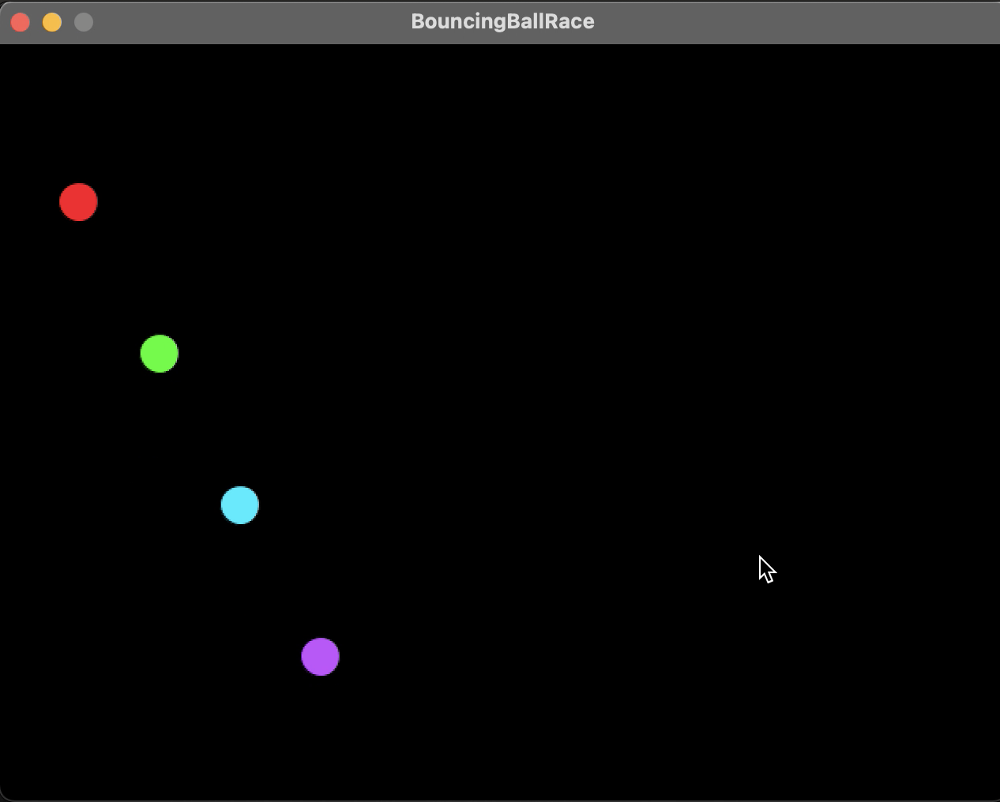

## The Race of Four Bouncing Balls !

Concepts implemented / Tools used:
* Object Oriented Programming
* Processing - creative coding
* Java
* Markdown
* Gradle
* Git
* Intellij ide

____________________________

[Secret: The ball does not only move in straight line]
##  ```Three! Two! One !```

[](video/BouncingBallRace.mp4)


___________________________

### Want to run the sketch for yourself?

STEPS:
1) `git clone` into the repo
2) Open intellij from the repo
3) Make sure the Java SDK is 1.8 or Java 8
4) Move into the src/main/java/BouncingBallRace.java
5) Press Control+Shift+R to run the sketch
6) Enjoy!

___________________________
